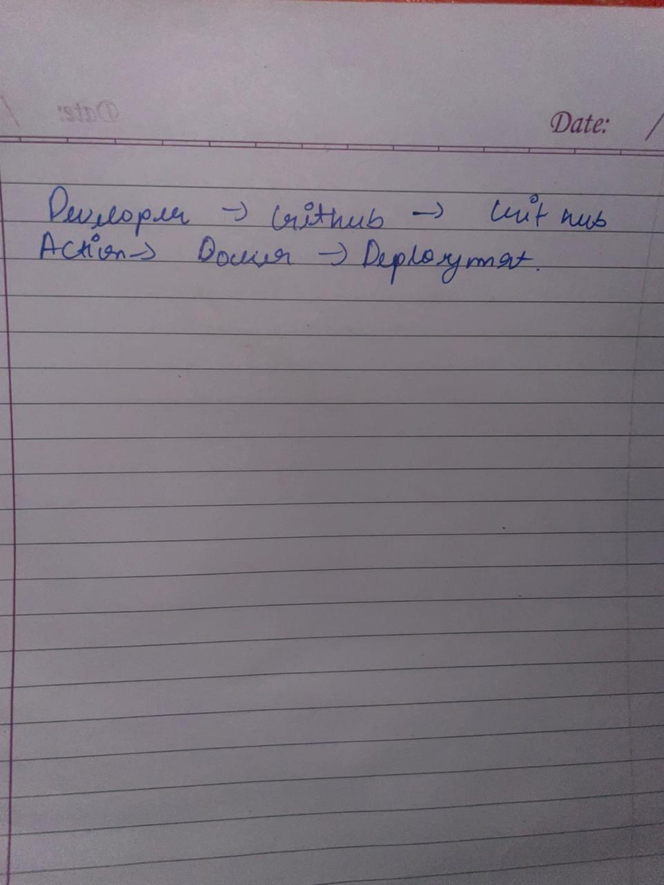
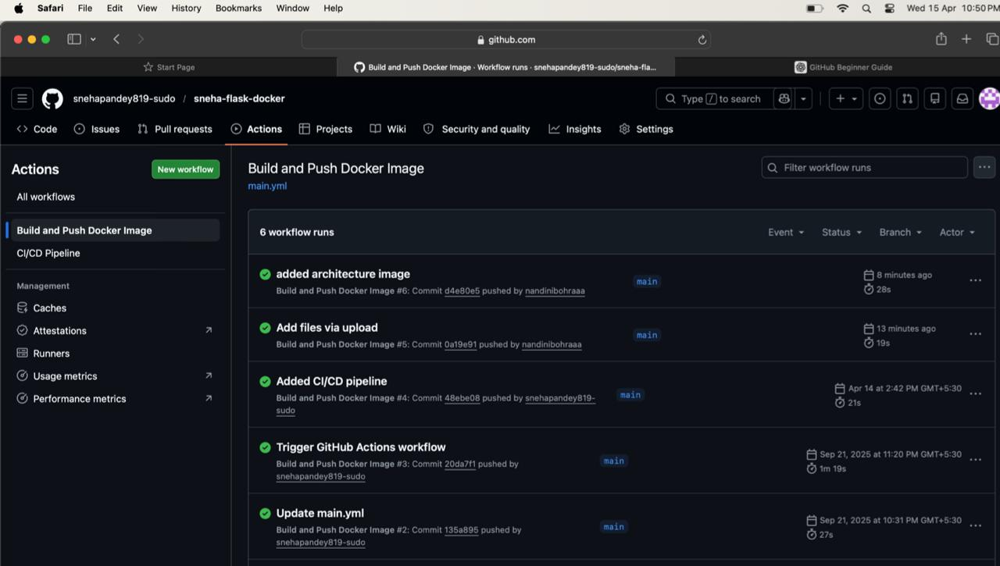
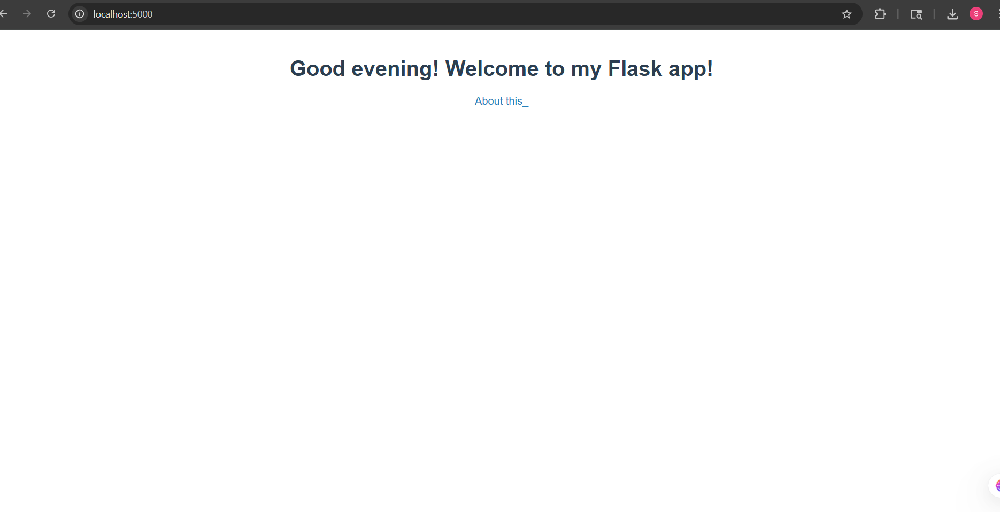

# Flask DevOps CI/CD Project

## Problem Statement
This project demonstrates how to automate the build, test, and deployment of a Flask web application using a CI/CD pipeline.

## Architecture
Developer → GitHub → GitHub Actions → DockerHub → Deployment

## CI/CD Pipeline
We implemented a CI/CD pipeline using GitHub Actions with the following stages:

- Build: Docker image is created
- Test: Basic validation step
- Deploy: Docker image is pushed to DockerHub using GitHub Secrets

## Git Workflow
- Created feature branches
- Used Pull Requests (PRs)
- Merged into main branch

## Tools Used
- GitHub
- GitHub Actions
- Docker
- Flask

## Screenshots

### Pipeline Success

## Contribution
Sneha: CI/CD pipeline, Docker, Deployment  
Nandini: Documentation, Architecture, Testing

## Challenges Faced
- Understanding GitHub Actions
- Setting up DockerHub login using secrets
- Working with branches and PRs

## Conclusion
This project successfully automates application deployment using modern DevOps practices.

## Deployment Output

Application running locally using Docker:

